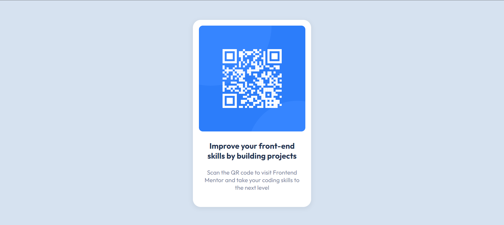

# Frontend Mentor - QR code component solution

This is a solution to the [QR code component challenge on Frontend Mentor](https://www.frontendmentor.io/challenges/qr-code-component-iux_sIO_H).

## Table of contents

- [Overview](#overview)
  - [Screenshot](#screenshot)
  - [Links](#links)
- [My process](#my-process)
  - [Built with](#built-with)
  - [What I learned](#what-i-learned)
  - [Continued development](#continued-development)
  - [Useful resources](#useful-resources)
- [Author](#author)

## Overview

### Screenshot

### Links

- Solution URL: [See the code on GitHub](https://github.com/KristinaRadosavljevic/QR-code-component)
- Live Site URL: [View live site](https://qr-code-component-beta-pearl.vercel.app/)

## My process

### Built with

- Semantic HTML5 markup
- Plain CSS

### What I learned

This was a very simple project which did not teach me much in terms of HTML/CSS, but it did give me an opportunity to get familiar with the deployment procedure on Vercel, particularly how different environments work.

### Continued development

Since this project was very simple, it lacks responsiveness (apart from using the `max-width` property). Therefore, I am going to focus more on this area in the future projects.

### Useful resources

I did get an opportunity to refresh my knowledge on how the `box-shadow` CSS property works. To that end, I used [MDN](https://developer.mozilla.org/en-US/docs/Web/CSS/box-shadow) as a resource.

## Author

- LinkedIn - [Kristina Radosavljevic](https://www.linkedin.com/in/radosavljevic-kristina/)
- GitHub - [KristinaRadosavljevic](https://github.com/KristinaRadosavljevic)
- Frontend Mentor - [@KristinaRadosavljevic](https://www.frontendmentor.io/profile/KristinaRadosavljevic)
